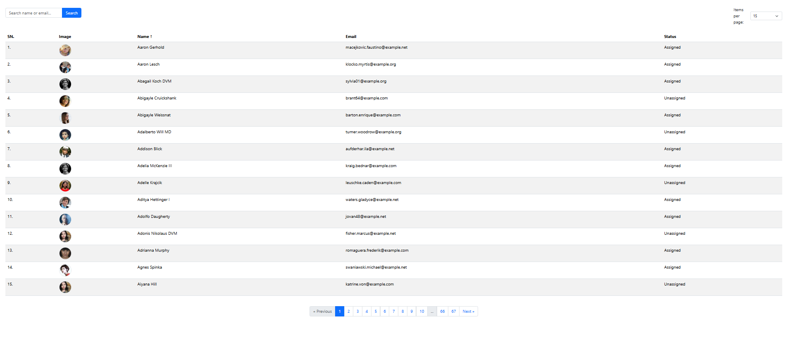

# 🌍 International Workplace Task Assessment

A Laravel + React + Inertia.js based user management system with pagination, sorting, searching, and filtering capabilities. This project showcases a robust full-stack implementation powered by Docker.

---

## 🚀 Features

- ✅ Paginated user listing with server-side pagination
- 🧪 Seeds 1000 random users with realistic data (via Faker)
- 🔍 Search users by **name** or **email**
- ⬆️⬇️ Sort users by **name** or **email** in ascending or descending order
- 🎯 Filter users per page: **15, 25, 40, 60, or 100**

---

## 🛠️ Built With

- ⚛️ [React](https://reactjs.org/)
- 🧱 [Laravel](https://laravel.com/)
- 🎨 [Tailwind CSS](https://tailwindcss.com/)
- 🧭 [Inertia.js](https://inertiajs.com/)
- ⚡ [Vite](https://vitejs.dev/)
- 🐳 [Docker](https://www.docker.com/)

---

## 📦 Local Installation

### 🔧 Prerequisites

- PHP 8.2+
- Composer
- Node.js (v18+ recommended)
- Docker & Docker Compose

### 🧰 Setup

```bash
# Clone the project
git clone https://github.com/your-username/internation-workplace-task-assessment.git
cd internation-workplace-task-assessment

# Build and start containers
docker-compose up --build

# Stop containers
docker-compose down

# Install backend dependencies
composer install

# Install frontend dependencies
npm install

# Copy .env and generate key
cp .env.example .env
php artisan key:generate

# Migrate and seed the database
php artisan migrate --seed

# Start the dev server
npm run dev


## 📸 Project Preview

